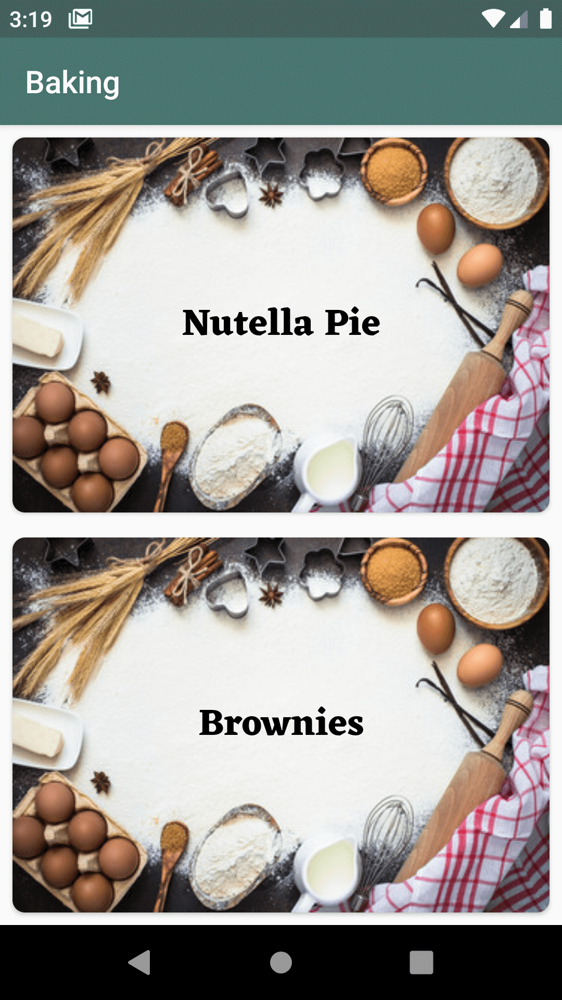
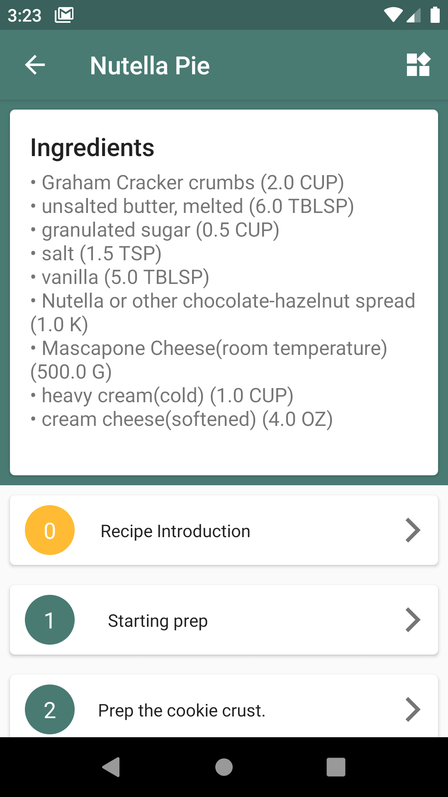
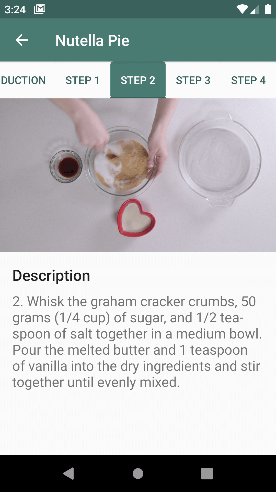
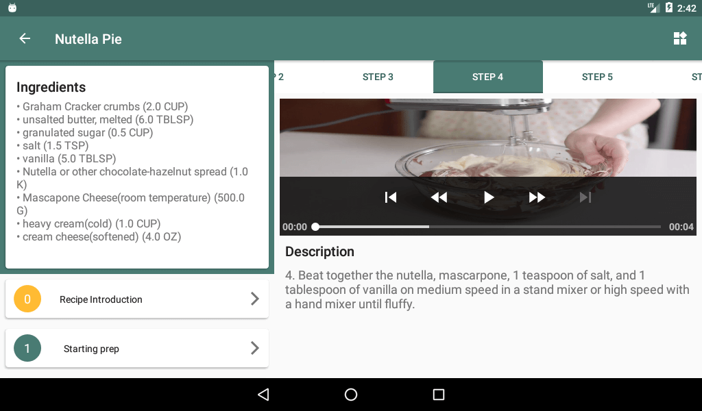

### Baking App

This app get recipe data from network and store in your local storage, and we can see detaile of recipe by clickng on it.
With each of these recipes you can make delicious things (Cheesecake).This app support big screen like tablet 
and you can also send the ingredients of your favorite recipes to your home screen widget to be easily accessible to you

## Screenshots

